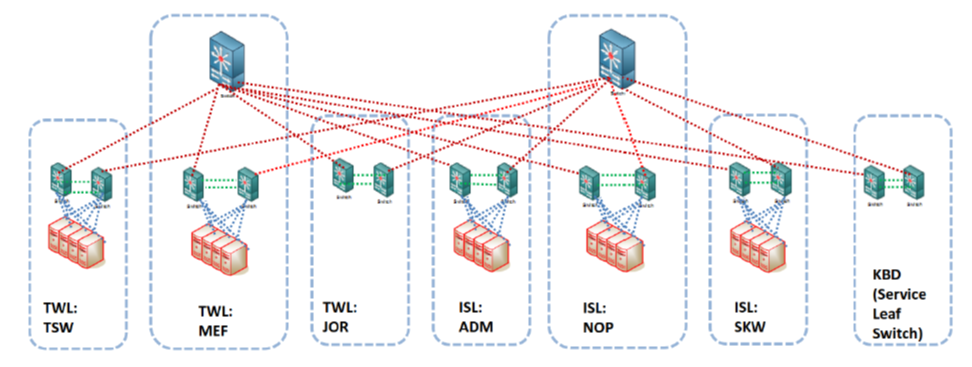

## Contract C5852.A-19E (Provision of SMS Equipment in Stations along TWL and ISL)

### Project Requirements:
The SMS Data Network shall be a new IP-based Software Defined Network (SDN) with spine and leaf architecture mainly comprises:

- Spine Layer
  - Two (2) core switches, one (1) at the SMS computer room of each of the two super hub stations (MEF and NOP) for disastrous recovery network connections to the distribution switches at the Leaf Layer in a full-mesh topology.
- Leaf Layer
  - Twelve (12) distribution switches, two (2) at the SMS computer room of each of the six hub stations (TSW, MEF, JOR, ADM, NOP and SKW) for:
    i) Uplink network connections to the core switches at Spine Layer in a full-mesh topology. The uplink network connection shall be able to support 48 x 10G server ports with at least 12:1 oversubscription ratio;
    ii) 10Gps link connections to the HCI servers located at TSW, MEF, ADM, NOP and SKW
  - Two (2) service leaf switches at KBD CER for:
    i) Uplink network connection to the core switches at the Spine Layer in a full-mesh topology. The uplink network connection shall be able to support 48 x 10G server ports with at least 12:1 oversubscription ratio;
    ii) 4 x 1Gps Connections to the CDN Backbone Network.

### High level design from tender RFPs:
 

### Tender Documents repo:
1. [Instructions to Tenderers](https://drive.google.com/file/d/17nwuOu3NRMatnStK-ZJn6sJTNVZutyex/view?usp=sharing)
2. [Particular Specifications](https://drive.google.com/file/d/1RCuUowN2vzatNt77E3PrKiyslhKf4PvT/view?usp=sharing)

### High Level Network Design
Please refer to [SMS network design docs](https://drive.google.com/file/d/1-Xo_MtMiolrIc3IL9ikH9wu78AOpsGef/view?usp=sharing) for details

### Proof of Concept and Demos
This is the powerpoint deck for demos: [MTRC SMS Project Demos powerpoint deck](https://drive.google.com/file/d/1SRnzvpT99Jzv3uAMacHFW0hJzgih7Qsx/view?usp=sharing)

### POC results
Please go to this folder for downloading screenshots for demo results:
[Demo Results](https://drive.google.com/drive/folders/18qgLmjReHmbQAU3Xk4KZev7WWB6Ju7AL?usp=sharing)

### POC configurations (QFX spine and leaf)
[Configs](MTRC/cfg)

